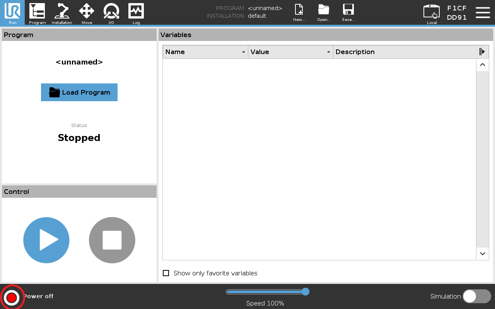
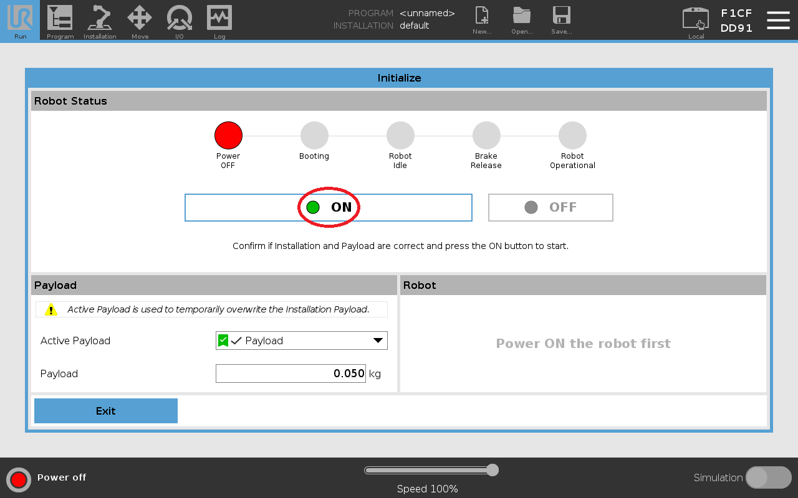
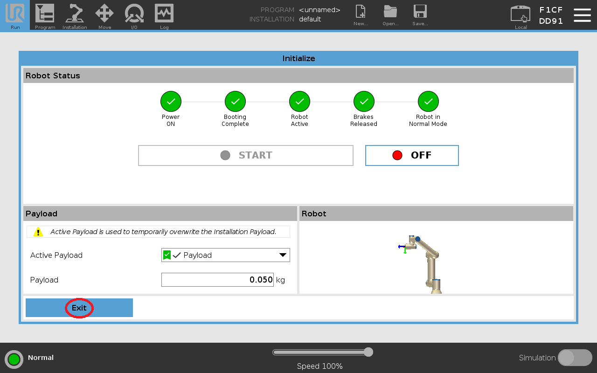
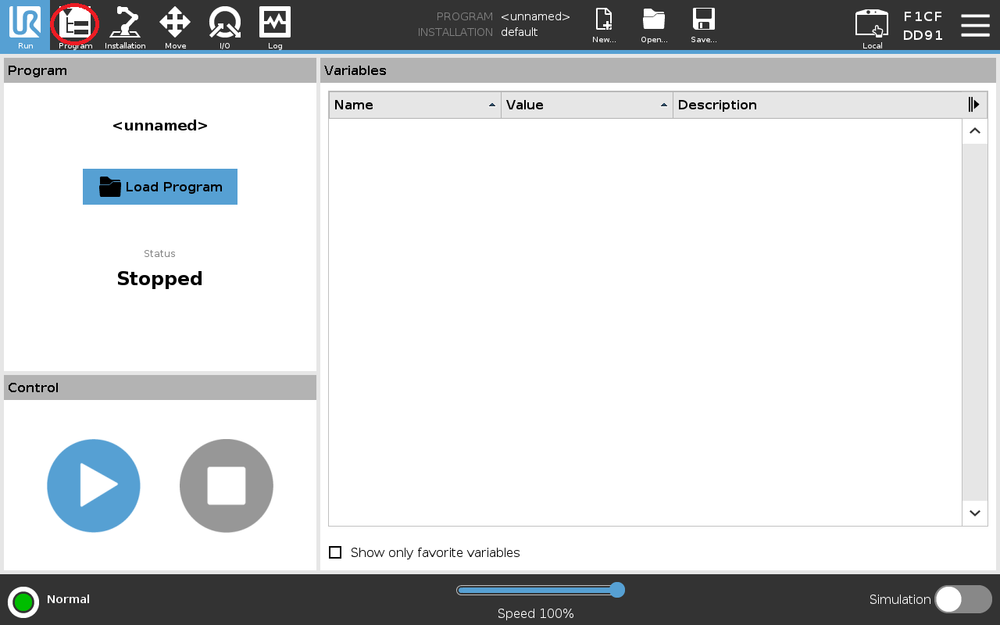
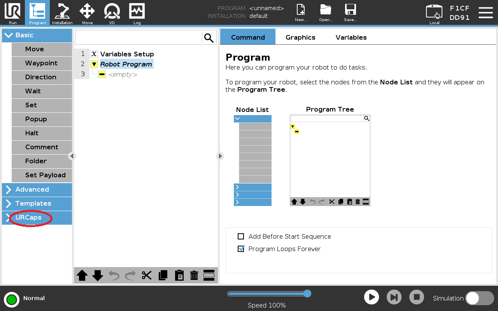
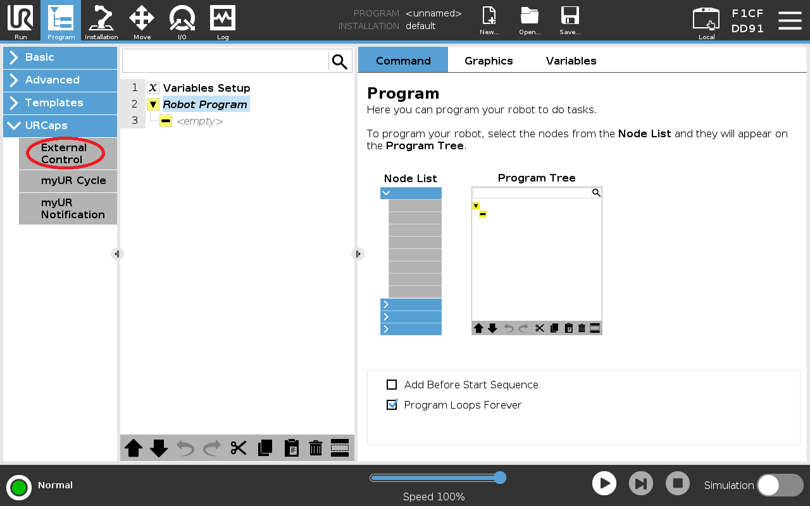
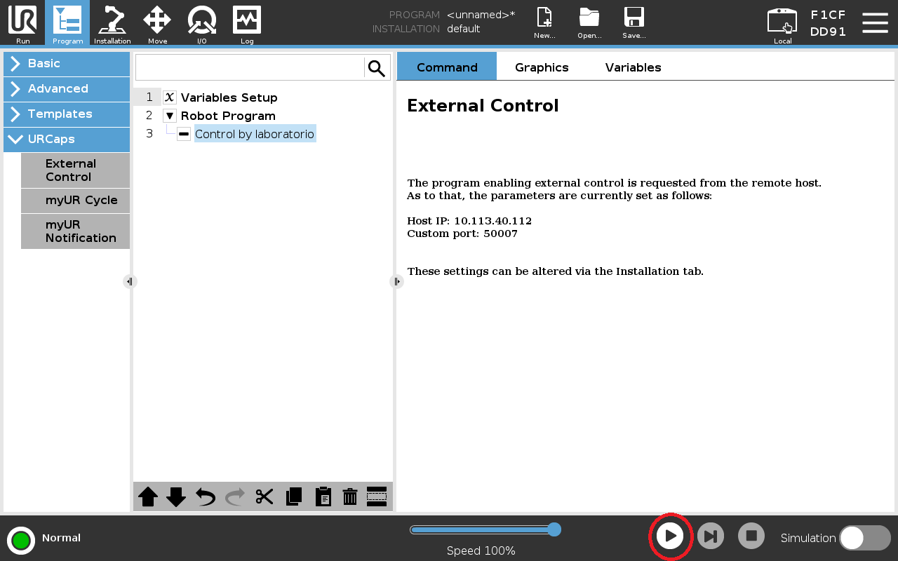

<div align="center">

<h1 align="center">UR Dual Pick-and-Place</h1>

<p align="center"><i>Perception-driven dual-arm pick-and-place for the UR5 + SoftHand workstation, built on ROS 2, MoveIt 2 and an RGB-D vision pipeline</i></p>

</div>

## 👋 Welcome

This repository implements a full **3D pick-and-place** system for the dual **UR5 / UR5e** workstation equipped with a **qb SoftHand 2 Research** end-effector and an externally mounted **OAK-D** RGB-D camera. Objects are detected by a custom **YOLOv11** model, localized in 3D through the GII [`GII/stereo_location`](https://github.com/GII/stereo_location) pipeline, and grasped collision-free using **MoveIt 2** planning over a live **OctoMap** of the workspace.

It is built as a **companion package** for the dual UR5 base system maintained at GII:
👉 [`SantaCRC/ur_softhand_dual`](https://github.com/SantaCRC/ur_softhand_dual/tree/SoftHand-jazzy) (branch `SoftHand-jazzy`)

The robot drivers, controllers and base MoveIt configuration come from that repo; this one adds the perception bridge, the category-aware OctoMap filtering, the manipulation commander, and the MoveIt configuration tuned for this cell. It is a sibling of the hand-eye calibration toolkit [`ur_dual_calibration`](https://github.com/GII/ur_dual_calibration), which provides the static camera↔robot transform this system depends on.

---

## 🧭 System Overview

The pipeline turns an RGB-D stream into a collision-free grasp through clearly separated stages:

```
  OAK-D depth/RGB ─┬─► YOLOv11 + stereo_location ──► /object_tracker/detections
                   │                                        │
                   │                         object_pose_bridge (select + TF to base)
                   │                                        │
                   │                          /ur_dual/object_pose  + /ur_dual/object_class
                   │                                        │
                   └─► octomap_input_filter ──► filtered depth ──► move_group OctoMap
                          (removes the target object's voxels by category)
                                                            │
                                          OctoMap relay (/monitored_planning_scene)
                                                            │
                                       ur_dual_command_services (MoveItPy commander)
                                          plan ► descend ► grasp ► attach ► place
```

Two design points are central to the system:

- **Category-aware OctoMap filtering.** A custom node zeroes the depth pixels that fall inside the detected object's axis-aligned bounding box, so the target object never becomes an obstacle in the OctoMap while every other obstacle is preserved. This is what makes the final approach to the object possible.
- **OctoMap relay into the commander's planning scene.** The MoveItPy commander runs its own `PlanningSceneMonitor` with no 3D sensor of its own; the OctoMap maintained by `move_group` is relayed into it as a planning-scene diff, so the commander plans against the same obstacles RViz shows.

---

## 📂 Repository Overview

```
📂 ur5-dual-pick-and-place
 ├── ur_dual_pick_place/                     # Manipulation + perception package (ament_python)
 │    ├── ur_dual_pick_place/
 │    │    ├── ur_dual_command_services.py    # Commander: ROS 2 services for the pick-and-place cycle
 │    │    ├── ur_dual_moveit_py.py           # MoveItPy wrapper (planning, cartesian, octomap relay)
 │    │    ├── object_pose_bridge.py          # YOLO/stereo detection → target pose (in base frame)
 │    │    ├── octomap_input_filter.py        # Category-aware depth filter (removes target voxels)
 │    │    └── obstacle_clusterer.py          # Optional perception-based collision boxes
 │    ├── launch/
 │    │    ├── perception.launch.py           # Camera + hand-eye + stereo_location + depth tuning
 │    │    ├── planning.launch.py             # move_group + commander + object_pose_bridge
 │    │    ├── ur_dual_command.launch.py      # Commander + octomap filter (+ clusterer)
 │    │    └── ur_dual_rviz.launch.py         # RViz with the manipulation displays
 │    ├── config/
 │    │    ├── motion_planning.yaml           # MoveItPy planning + scene-monitor config
 │    │    ├── octomap_sensors.yaml           # DepthImageOctomapUpdater config
 │    │    ├── oak_depth_octomap_tuned.yaml   # Tuned OAK depth params for clean voxels
 │    │    └── oak_camera_params.yaml
 │    ├── scripts/
 │    │    ├── v1_capture.py                  # Validation V1 (YOLO detection rate) capture
 │    │    ├── v2_capture.py                  # Validation V2 (3D centroid stability) capture
 │    ├── package.xml
 │    └── setup.py
 ├── ur_dual_moveit_config/                   # MoveIt 2 configuration for the dual UR5 + SoftHand
 │    ├── config/                             # SRDF, kinematics, OMPL, controllers, octomap sensors
 │    └── launch/                             # move_group.launch.py, moveit_rviz.launch.py
 ├── apply_oak_depth_tuned.sh                 # Applies tuned depth params to the running OAK driver
 ├── setup.bash
 ├── images/                                  # Teach-pendant screenshots for the init guide
 ├── LICENSE
 └── README.md                               # You're here! 👋
```

---

## ⚙️ Requirements

✅ **ROS 2 Jazzy** (Ubuntu 24.04)  
✅ Workspace named `~/ws_daniel` (any name is fine, paths below assume this)  
✅ Base system from [`ur_softhand_dual`](https://github.com/SantaCRC/ur_softhand_dual/tree/SoftHand-jazzy) (dual UR drivers + controllers)  
✅ [`ur_dual_calibration`](https://github.com/GII/ur_dual_calibration) publishing the static camera↔robot TF  
✅ **OAK-D** camera with `depthai_ros_driver` (v3 API)  
✅ GII [`stereo_location`](https://github.com/GII/stereo_location) package + the trained **YOLOv11** weights (10 custom classes)  
✅ **MoveIt 2** (the version shipped with Jazzy), with `compute_cartesian_path` and `get_planning_scene` capabilities enabled in `move_group`  
✅ Python 3.12 with `numpy`, `opencv-python` (≥ 4.6)  

---

## 🛠️ Setup & Installation

1️⃣ Clone the **base system** first (the dual UR + SoftHand stack):
```bash
# From: ~/ws_daniel/src
git clone -b SoftHand-jazzy https://github.com/SantaCRC/ur_softhand_dual.git
```

2️⃣ Clone this repository and the calibration companion into `src/`:
```bash
# From: ~/ws_daniel/src
git clone https://github.com/GII/ur5-dual-pick-and-place.git
git clone https://github.com/GII/ur_dual_calibration.git
```

3️⃣ Install dependencies and build:
```bash
# From: ~/ws_daniel
rosdep update && rosdep install --from-paths src --ignore-src -r -y
colcon build --symlink-install
source install/setup.bash
```

> ℹ️ If `colcon` reports a **duplicate package** for `ur_dual_pick_place`, you have two copies in the workspace (for example a staging clone and the in-tree one). Keep a single copy on the build path and drop a `COLCON_IGNORE` file in the other.

---

## 🤖 Robot Initialization (UR5 Teach Pendant)

Follow this step-by-step guide to power on the UR5 robotic arm, initialize it, and establish the external control communication loop with the master PC.

### 1. System Power-Up

* **Step 01** — Power on the UR5 Control Box and wait for the PolyScope graphical interface to load. Tap the robot status indicator (bottom left corner) to access the initialization screen.



* **Step 02** — Turn on the robot electronics by pressing **ON**.



* **Step 03** — Tap **START** to release the mechanical brakes. You will hear a distinct click from each joint.


* **Step 04** — Verify that the status indicator turns solid green and shows **Normal**. Return to the main menu.



### 2. Load the External Control Program

* **Step 05** — Select **Program Robot**.



* **Step 06** — Load the existing **URCaps → External Control** program.



* **Step 07** — Open the External Control node and check its parameters.



* **Step 08** — Double-check that the **PC IP address** and **port** match your local network setup. Leave the program ready on the Teach Pendant. **Do not press Play yet.**



### 3. Launch the PC Driver and Connect

Open a terminal on the workstation and launch the dual-arm driver:

```bash
ros2 launch ur_dual_control start_robot.launch.py
```

Once the driver is up and waiting for the hardware connection, complete the loop on the Teach Pendant:

* **Step 09** — Press **Play** at the bottom of the Teach Pendant to establish the remote connection loop.


* **Step 10** — The program switches to active. The driver terminal on the PC reports a successful connection. The UR5 is now listening to external motion commands.


---

## 🚀 Launching the System

With the robot driver connected (above), the rest of the stack comes up in **three more terminals**. Source the workspace (`source install/setup.bash`) in each.

```bash
# T1 — Robot driver (see the init guide above)
ros2 launch ur_dual_control start_robot.launch.py

# T2 — Perception: OAK-D camera + hand-eye TF + stereo_location + depth tuning
ros2 launch ur_dual_pick_place perception.launch.py

# T3 — RViz
ros2 launch ur_dual_pick_place ur_dual_rviz.launch.py

# T4 — Planning: move_group + commander + object_pose_bridge
ros2 launch ur_dual_pick_place planning.launch.py
```

`perception.launch.py` bundles the camera driver, the static hand-eye TF, the `stereo_location` perception pipeline and the OAK depth tuning (`apply_oak_depth_tuned.sh`, applied after a short delay so the camera is up). `planning.launch.py` brings up `move_group`, then the commander and the detection bridge after `move_group` has loaded, which keeps the OctoMap relay and service discovery clean.

> 💡 Bring `move_group` fully up before the commander. If a cartesian or planning-scene service shows as visible but unavailable, it is usually a stale discovery endpoint from a previous `move_group`; restarting the planning launch resolves it.

### Selecting the target object

The detection bridge selects the highest-confidence detection of a chosen class. Set it when launching, or live:

```bash
ros2 param set /object_pose_bridge target_class vaca
```

Supported classes (YOLO labels): `bola`, `botella rosa`, `caballo`, `cubo`, `lechuga`, `pina`, `prisma`, `refresco`, `tomate`, `vaca`.

---

## 🎯 Running a Pick-and-Place Cycle

The commander exposes the cycle as discrete ROS 2 services so each step can be verified in RViz before execution. The sequence below is the validated flow for **top-grasp** objects (`vaca`, `cubo`, `pina`, `bola`). Run the commands in order; inspect the planned trajectory in RViz before every `execute_last_plan`.

```bash
# Freeze the OctoMap (snapshot the world; the moving arm won't pollute it)
ros2 service call /ur_dual/freeze_octomap std_srvs/srv/Trigger "{}"

# Plan + execute the pre-grasp (collision-free against the OctoMap)
ros2 service call /ur_dual/plan_pregrasp_from_latest_pose std_srvs/srv/Trigger "{}"
ros2 service call /ur_dual/execute_last_plan std_srvs/srv/SetBool "{data: true}"

# Straight descent onto the object (3 cm), then close + attach
ros2 param set /ur_dual_commander offset_test_dz -0.03
ros2 service call /ur_dual/plan_offset_test std_srvs/srv/Trigger "{}"
ros2 service call /ur_dual/execute_last_plan std_srvs/srv/SetBool "{data: true}"
ros2 service call /ur_dual/close_hand std_srvs/srv/Trigger "{}"
ros2 service call /ur_dual/attach_grasped_object std_srvs/srv/Trigger "{}"

# Lift (4 cm), move to ready, then to the place pose
ros2 param set /ur_dual_commander offset_test_dz 0.04
ros2 service call /ur_dual/plan_offset_test std_srvs/srv/Trigger "{}"
ros2 service call /ur_dual/execute_last_plan std_srvs/srv/SetBool "{data: true}"
ros2 service call /ur_dual/plan_ready_right std_srvs/srv/Trigger "{}"
ros2 service call /ur_dual/execute_last_plan std_srvs/srv/SetBool "{data: true}"
ros2 service call /ur_dual/plan_place_normal std_srvs/srv/Trigger "{}"
ros2 service call /ur_dual/execute_last_plan std_srvs/srv/SetBool "{data: true}"

# Descend at the place (3 cm), release, retreat, reset
ros2 param set /ur_dual_commander offset_test_dz -0.03
ros2 service call /ur_dual/plan_offset_test std_srvs/srv/Trigger "{}"
ros2 service call /ur_dual/execute_last_plan std_srvs/srv/SetBool "{data: true}"
ros2 service call /ur_dual/detach_grasped_object std_srvs/srv/Trigger "{}"
ros2 service call /ur_dual/open_hand std_srvs/srv/Trigger "{}"
ros2 param set /ur_dual_commander offset_test_dz 0.04
ros2 service call /ur_dual/plan_offset_test std_srvs/srv/Trigger "{}"
ros2 service call /ur_dual/execute_last_plan std_srvs/srv/SetBool "{data: true}"
ros2 service call /ur_dual/plan_ready_right std_srvs/srv/Trigger "{}"
ros2 service call /ur_dual/execute_last_plan std_srvs/srv/SetBool "{data: true}"
ros2 service call /ur_dual/unfreeze_octomap std_srvs/srv/Trigger "{}"
```


### Service reference

| Service | Type | Purpose |
|---|---|---|
| `/ur_dual/plan_pregrasp_from_latest_pose` | Trigger | Plan (OMPL) to the pre-grasp pose of the latest detected object |
| `/ur_dual/plan_offset_test` | Trigger | Straight-line cartesian move by `offset_test_d{x,y,z}` from the current pose |
| `/ur_dual/execute_last_plan` | SetBool | Execute (`true`) or discard (`false`) the pending plan |
| `/ur_dual/close_hand`, `/ur_dual/open_hand` | Trigger | Command the SoftHand synergy |
| `/ur_dual/attach_grasped_object`, `/ur_dual/detach_grasped_object` | Trigger | Attach/detach the grasped object to the hand in the planning scene |
| `/ur_dual/plan_ready_right`, `/ur_dual/plan_place_normal`, `/ur_dual/plan_place_bottle` | Trigger | Plan to named poses (SRDF) |
| `/ur_dual/freeze_octomap`, `/ur_dual/unfreeze_octomap` | Trigger | Stop/start the OAK pipeline to freeze the OctoMap during execution |
| `/ur_dual/clear_octomap_around_object` | Trigger | Clear OctoMap voxels in a box sized to the detected object's class |
| `/ur_dual/octomap_filter/enable` | SetBool | Enable/disable the category-aware depth filter |

---

## 🩺 Troubleshooting

* **The commander plans through visible obstacles / its OctoMap is empty** — the commander's `PlanningSceneMonitor` is not receiving the OctoMap. This system relays `move_group`'s `/monitored_planning_scene` into the commander's scene as a diff; confirm the relay log line reports a non-zero OctoMap resolution at startup.
* **`/compute_cartesian_path` shows in `ros2 service list` but the commander reports it unavailable** — stale DDS discovery endpoint after a `move_group` restart. Restart the planning launch; if it persists, `pkill -9 -f move_group`, `ros2 daemon stop`, then bring `move_group` up before the commander.
* **`CARTESIAN_FRACTION_TOO_LOW` on a descent** — the straight path is being blocked (residual object voxels or a kinematic limit). Relax the cartesian fraction tolerance.
* **The closed SoftHand is flagged as a self-collision** — the SoftHand's internal configuration is governed by its own synergy controller and is not part of the arm planning group; intra-hand collision pairs are disabled in the SRDF to avoid false positives from the closed-hand posture.
* **The filter reports `Filtré 0 píxeles` for thin or glossy objects** — the estimated object pose and the depth surface can differ by a few centimetres. Increase `filter_margin` so the bounding box covers the actual voxels.
* **No `/oak_cam/...` topics** — the camera driver is not running or the namespace differs. Re-launch the perception stack.

---

## 🏆 Acknowledgments

Developed at the **Grupo Integrado de Ingeniería (GII), Universidade da Coruña** as part of a Final Degree Project (TFG) in collaboration with the Instituto Tecnológico de Costa Rica (TEC).

Built on top of [`ur_softhand_dual`](https://github.com/SantaCRC/ur_softhand_dual) by Fabián Álvarez ([@SantaCRC](https://github.com/SantaCRC)), and used together with the [`ur_dual_calibration`](https://github.com/GII/ur_dual_calibration) toolkit.

Special thanks to the GII Lab for hosting this research stay.

---

## 📜 License

MIT — see [`LICENSE`](LICENSE) for details.

---
